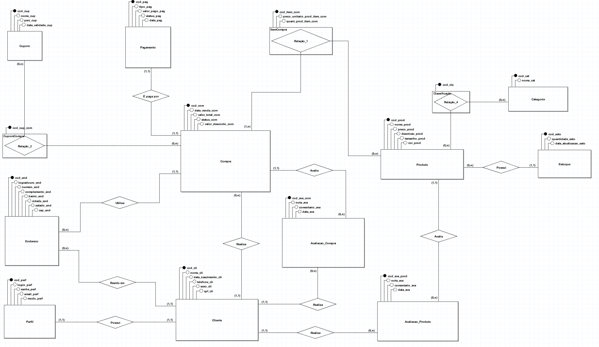
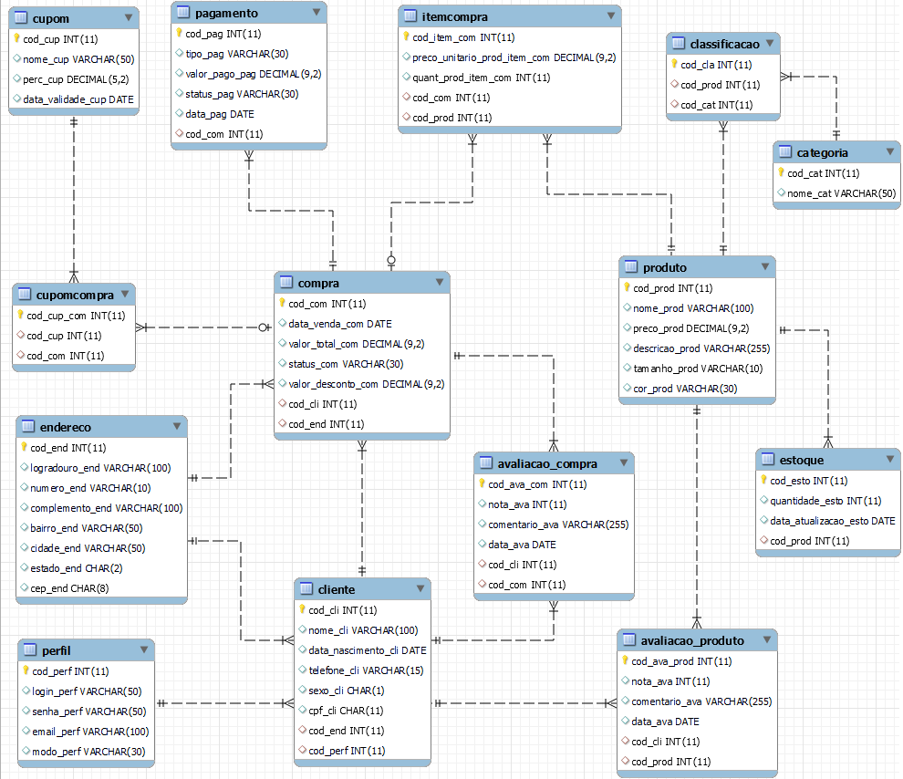

# Sistema de E-Commerce - Maré Alta

**Instituição:** Instituto Federal de Educação, Ciência e Tecnologia Triângulo Mineiro (IFTM) - Campus Uberlândia Centro  
**Autores:** Daniel Sambini Ramos, Gustavo Ferrari Martins, Maria Gabrielly Bernardes Santana, Rafael Silva Nascimento, Victor Musashi Takimura Siquieroli  
**Ano:** 2026  

---

## 1. Descrição do Sistema e Modelagem

### Descrição da Regra de Negócio
O sistema de e-commerce de moda praia tem como objetivo armazenar informações sobre perfis, endereços, clientes, categorias, produtos, estoques, cupons de desconto, compras, pagamentos e avaliações.

* **Perfis e Clientes:** Para os perfis, são armazenados código, login, senha, e-mail e modo de acesso. Cada perfil vincula-se a exatamente um cliente. Para os clientes, armazenam-se código, nome, data de nascimento, telefone, sexo e CPF. Cada cliente possui exatamente um perfil e um endereço cadastrado.
* **Endereços:** Armazenam código, logradouro, número, complemento, bairro, cidade, estado e CEP. Pode estar associado a nenhum ou vários clientes e ser usado como endereço de entrega em várias compras.
* **Categorias, Produtos e Estoque:** Organizados por categorias (código e nome). Produtos contêm código, nome, preço, descrição, tamanho e cor. A relação N:M entre produto e categoria é gerida pela tabela associativa `Classificacao`. O controle de estoque armazena quantidade e data da última atualização para cada produto.
* **Cupons, Compras e Itens:** Cupons possuem código, nome, percentual de desconto e validade, vinculando-se às compras via `CupomCompra`. As compras contêm data, valor total, status e desconto. A relação N:M de produtos por compra é gerenciada por `ItemCompra`.
* **Pagamentos e Avaliações:** Pagamentos armazenam tipo, valor, status e data, vinculados 1:1 com compras. Clientes podem realizar avaliações de produtos (`Avaliacao_Produto`) e de compras (`Avaliacao_Compra`).

---

### Modelo Entidade-Relacionamento (MER)
> **Dica:** Salve a imagem do diagrama no seu repositório (ex: na pasta `img/mer.png`) e atualize o caminho abaixo:



---

### Modelo Lógico Relacional

* **Perfil** (`cod_perf`, login_perf, senha_perf, email_perf, modo_perf)
* **Endereco** (`cod_end`, logradouro_end, numero_end, complemento_end, bairro_end, cidade_end, estado_end, cep_end)
* **Cliente** (`cod_cli`, nome_cli, data_nascimento_cli, telefone_cli, sexo_cli, cpf_cli, *cod_end*, *cod_perf*)
  * *cod_end* referencia **Endereco**
  * *cod_perf* referencia **Perfil**
* **Categoria** (`cod_cat`, nome_cat)
* **Produto** (`cod_prod`, nome_prod, preco_prod, descricao_prod, tamanho_prod, cor_prod)
* **Classificacao** (`cod_cla`, *cod_prod*, *cod_cat*)
  * *cod_prod* referencia **Produto**
  * *cod_cat* referencia **Categoria**
* **Estoque** (`cod_esto`, quantidade_esto, data_atualizacao_esto, *cod_prod*)
  * *cod_prod* referencia **Produto**
* **Cupom** (`cod_cup`, nome_cup, perc_cup, data_validade_cup)
* **Compra** (`cod_com`, data_venda_com, valor_total_com, status_com, valor_desconto_com, *cod_cli*, *cod_end*)
  * *cod_cli* referencia **Cliente**
  * *cod_end* referencia **Endereco**
* **CupomCompra** (`cod_cup_com`, *cod_cup*, *cod_com*)
  * *cod_cup* referencia **Cupom**
  * *cod_com* referencia **Compra**
* **ItemCompra** (`cod_item_com`, preco_unitario_prod_item_com, quant_prod_item_com, *cod_com*, *cod_prod*)
  * *cod_com* referencia **Compra**
  * *cod_prod* referencia **Produto**
* **Pagamento** (`cod_pag`, tipo_pag, valor_pago_pag, status_pag, data_pag, *cod_com*)
  * *cod_com* referencia **Compra**
* **Avaliacao_Produto** (`cod_ava_prod`, nota_ava, comentario_ava, data_ava, *cod_cli*, *cod_prod*)
  * *cod_cli* referencia **Cliente**
  * *cod_prod* referencia **Produto**
* **Avaliacao_Compra** (`cod_ava_com`, nota_ava, comentario_ava, data_ava, *cod_cli*, *cod_com*)
  * *cod_cli* referencia **Cliente**
  * *cod_com* referencia **Compra**

---

### Modelo Lógico - Engenharia Reversa (MySQL)


---

## 2. Estrutura do Banco de Dados (DDL)

```sql
CREATE DATABASE Mare_Alta;
USE Mare_Alta;

CREATE TABLE Perfil (
    cod_perf INT PRIMARY KEY,
    login_perf VARCHAR(50),
    senha_perf VARCHAR(50),
    email_perf VARCHAR(100),
    modo_perf VARCHAR(30)
);

CREATE TABLE Endereco (
    cod_end INT PRIMARY KEY,
    logradouro_end VARCHAR(100),
    numero_end VARCHAR(10),
    complemento_end VARCHAR(100),
    bairro_end VARCHAR(50),
    cidade_end VARCHAR(50),
    estado_end CHAR(2),
    cep_end CHAR(8)
);

CREATE TABLE Cliente (
    cod_cli INT PRIMARY KEY,
    nome_cli VARCHAR(100),
    data_nascimento_cli DATE,
    telefone_cli VARCHAR(15),
    sexo_cli CHAR(1),
    cpf_cli CHAR(11),
    cod_end INT,
    cod_perf INT,
    FOREIGN KEY (cod_end) REFERENCES Endereco (cod_end),
    FOREIGN KEY (cod_perf) REFERENCES Perfil (cod_perf)
);

CREATE TABLE Categoria (
    cod_cat INT PRIMARY KEY,
    nome_cat VARCHAR(50)
);

CREATE TABLE Produto (
    cod_prod INT PRIMARY KEY,
    nome_prod VARCHAR(100),
    preco_prod NUMERIC(9,2),
    descricao_prod VARCHAR(255),
    tamanho_prod VARCHAR(10),
    cor_prod VARCHAR(30)
);

CREATE TABLE Classificacao (
    cod_cla INT PRIMARY KEY,
    cod_prod INT,
    cod_cat INT,
    FOREIGN KEY (cod_prod) REFERENCES Produto (cod_prod),
    FOREIGN KEY (cod_cat) REFERENCES Categoria (cod_cat)
);

CREATE TABLE Estoque (
    cod_esto INT PRIMARY KEY,
    quantidade_esto INT,
    data_atualizacao_esto DATE,
    cod_prod INT,
    FOREIGN KEY (cod_prod) REFERENCES Produto (cod_prod)
);

CREATE TABLE Cupom (
    cod_cup INT PRIMARY KEY,
    nome_cup VARCHAR(50),
    perc_cup NUMERIC(5,2),
    data_validade_cup DATE
);

CREATE TABLE Compra (
    cod_com INT PRIMARY KEY,
    data_venda_com DATE,
    valor_total_com NUMERIC(9,2),
    status_com VARCHAR(30),
    valor_desconto_com NUMERIC(9,2),
    cod_cli INT,
    cod_end INT,
    FOREIGN KEY (cod_cli) REFERENCES Cliente (cod_cli),
    FOREIGN KEY (cod_end) REFERENCES Endereco (cod_end)
);

CREATE TABLE CupomCompra (
    cod_cup_com INT PRIMARY KEY,
    cod_cup INT,
    cod_com INT,
    FOREIGN KEY (cod_cup) REFERENCES Cupom (cod_cup),
    FOREIGN KEY (cod_com) REFERENCES Compra (cod_com)
);

CREATE TABLE ItemCompra (
    cod_item_com INT PRIMARY KEY,
    preco_unitario_prod_item_com NUMERIC(9,2),
    quant_prod_item_com INT,
    cod_com INT,
    cod_prod INT,
    FOREIGN KEY (cod_com) REFERENCES Compra (cod_com),
    FOREIGN KEY (cod_prod) REFERENCES Produto (cod_prod)
);

CREATE TABLE Pagamento (
    cod_pag INT PRIMARY KEY,
    tipo_pag VARCHAR(30),
    valor_pago_pag NUMERIC(9,2),
    status_pag VARCHAR(30),
    data_pag DATE,
    cod_com INT,
    FOREIGN KEY (cod_com) REFERENCES Compra (cod_com)
);

CREATE TABLE Avaliacao_Produto (
    cod_ava_prod INT PRIMARY KEY,
    nota_ava INT,
    comentario_ava VARCHAR(255),
    data_ava DATE,
    cod_cli INT,
    cod_prod INT,
    FOREIGN KEY (cod_cli) REFERENCES Cliente (cod_cli),
    FOREIGN KEY (cod_prod) REFERENCES Produto (cod_prod)
);

CREATE TABLE Avaliacao_Compra (
    cod_ava_com INT PRIMARY KEY,
    nota_ava INT,
    comentario_ava VARCHAR(255),
    data_ava DATE,
    cod_cli INT,
    cod_com INT,
    FOREIGN KEY (cod_cli) REFERENCES Cliente (cod_cli),
    FOREIGN KEY (cod_com) REFERENCES Compra (cod_com)
);


INSERT INTO Perfil VALUES
(1,'amandasilva','123456','amanda.silva@gmail.com','Cliente'),
(2,'brunacosta','123456','bruna.costa@gmail.com','Cliente'),
(3,'carololiveira','123456','carol.oliveira@gmail.com','Cliente'),
(4,'danielsouza','123456','daniel.souza@gmail.com','Cliente'),
(5,'elenasantos','123456','elena.santos@gmail.com','Cliente'),
(6,'felipelima','123456','felipe.lima@gmail.com','Cliente'),
(7,'gabrielmartins','123456','gabriel.martins@gmail.com','Cliente'),
(8,'isabellarocha','123456','isabella.rocha@gmail.com','Cliente'),
(9,'julianapires','123456','juliana.pires@gmail.com','Cliente'),
(10,'lucasferreira','123456','lucas.ferreira@gmail.com','Cliente');

INSERT INTO Endereco VALUES
(1,'Rua das Palmeiras','120','Casa','Centro','Ubatuba','SP','11680000'),
(2,'Avenida Atlântica','450','Apto 22','Praia Grande','Santos','SP','11070000'),
(3,'Rua das Gaivotas','98','','Canasvieiras','Florianópolis','SC','88054000'),
(4,'Rua do Farol','80','','Centro','Guarujá','SP','11410000'),
(5,'Avenida Beira Mar','302','Bloco B','Meireles','Fortaleza','CE','60165120'),
(6,'Rua dos Coqueiros','52','','Ponta Negra','Natal','RN','59090002'),
(7,'Rua das Conchas','16','','Praia do Forte','Cabo Frio','RJ','28908000'),
(8,'Avenida Oceânica','210','Apto 101','Barra','Salvador','BA','40140130'),
(9,'Rua do Sol','490','','Manaíra','João Pessoa','PB','58038020'),
(10,'Rua Praia Azul','130','','Centro','Balneário Camboriú','SC','88330045');

INSERT INTO Cliente VALUES
(1,'Amanda Silva','1998-04-15','11998563214','F','12345678901',1,1),
(2,'Bruna Costa','1996-09-12','11995412687','F','23456789012',2,2),
(3,'Carolina Oliveira','1994-11-02','11997856321','F','34567890123',3,3),
(4,'Daniel Souza','1993-01-18','11996325874','M','45678901234',4,4),
(5,'Elena Santos','1997-08-25','11998745612','F','56789012345',5,5),
(6,'Felipe Lima','1995-06-03','11995478321','M','67890123456',6,6),
(7,'Gabriel Martins','1992-12-28','11997654123','M','78901234567',7,7),
(8,'Isabella Rocha','1999-07-07','11998123456','F','89012345678',8,8),
(9,'Juliana Pires','1991-03-20','11999563214','F','90123456789',9,9),
(10,'Lucas Ferreira','1990-10-14','11998774125','M','01234567890',10,10);

INSERT INTO Categoria VALUES
(1,'Biquínis'),
(2,'Maiôs'),
(3,'Saídas de Praia'),
(4,'Acessórios'),
(5,'Moda Masculina');

INSERT INTO Produto VALUES 
(1,'Biquíni Cortininha Floral',129.90,'Biquíni estampado floral com proteção UV','P','Azul Floral'),
(2,'Maiô Cavado Preto',159.90,'Maiô cavado com tecido de secagem rápida','M','Preto'),
(3,'Saída de Praia Longa',189.90,'Saída de praia em tecido leve e transparente','Único','Branco'),
(4,'Chapéu de Palha',79.90,'Chapéu de palha com aba larga','Único','Palha'),
(5,'Canga Tropical',69.90,'Canga estampada em tecido leve','Único','Colorida'),
(6,'Sunga Lisa',89.90,'Sunga masculina em poliamida','M','Azul Marinho'),
(7,'Short Praia Masculino',119.90,'Short estampado de secagem rápida','G','Verde Água'),
(8,'Bolsa de Palha',149.90,'Bolsa artesanal para praia','Único','Bege'),
(9,'Óculos de Sol Polarizado',199.90,'Óculos com proteção UV400','Único','Preto'),
(10,'Chinelo Feminino',59.90,'Chinelo antiderrapante confortável','37','Rosa');

INSERT INTO Classificacao VALUES
(1,1,1),
(2,2,2),
(3,3,3),
(4,4,4),
(5,5,4),
(6,6,5),
(7,7,5),
(8,8,4),
(9,9,4),
(10,10,4);

INSERT INTO Estoque VALUES
(1,40,'2026-07-01',1),
(2,25,'2026-07-01',2),
(3,18,'2026-07-02',3),
(4,50,'2026-07-02',4),
(5,35,'2026-07-03',5),
(6,28,'2026-07-03',6),
(7,22,'2026-07-04',7),
(8,17,'2026-07-04',8),
(9,30,'2026-07-05',9),
(10,45,'2026-07-05',10);

INSERT INTO Cupom VALUES
(1,'VERAO10',10.00,'2026-12-31'),
(2,'PRAIA15',15.00,'2026-11-30'),
(3,'MAREALTA20',20.00,'2026-10-31'),
(4,'SOL25',25.00,'2026-09-30'),
(5,'BEMVINDO5',5.00,'2026-12-15');

INSERT INTO Compra VALUES
(1,'2026-07-01',197.81,'Concluída',21.99,1,1),
(2,'2026-07-02',159.90,'Concluída',0.00,2,2),
(3,'2026-07-03',215.92,'Concluída',53.98,3,3),
(4,'2026-07-03',189.90,'Concluída',0.00,4,4),
(5,'2026-07-04',227.81,'Concluída',11.99,5,5),
(6,'2026-07-04',89.90,'Concluída',0.00,6,6),
(7,'2026-07-05',239.80,'Concluída',79.90,7,7),
(8,'2026-07-05',149.90,'Concluída',0.00,8,8),
(9,'2026-07-06',246.81,'Concluída',12.99,9,9),
(10,'2026-07-06',199.90,'Concluída',0.00,10,10);

INSERT INTO CupomCompra VALUES
(1,1,1),
(2,2,3),
(3,5,5),
(4,4,7),
(5,5,9);

INSERT INTO ItemCompra VALUES
(1,129.90,1,1,1),
(2,79.90,1,1,4),
(3,159.90,1,2,2),
(4,189.90,1,3,3),
(5,69.90,1,3,5),
(6,189.90,1,4,3),
(7,159.90,1,5,2),
(8,59.90,1,5,10),
(9,89.90,1,6,6),
(10,119.90,1,7,7),
(11,199.90,1,7,9),
(12,149.90,1,8,8),
(13,199.90,1,9,9),
(14,59.90,1,9,10),
(15,199.90,1,10,9);

INSERT INTO Pagamento VALUES
(1,'PIX', 197.81,'Pago', '2026-07-01',1),
(2,'Cartão de Crédito', 159.90, 'Pago', '2026-07-02',2),
(3,'PIX', 215.92, 'Pago', '2026-07-03',3),
(4,'Boleto', 189.90, 'Pago', '2026-07-03',4),
(5,'Cartão de Débito', 227.81, 'Pago', '2026-07-04',5),
(6,'PIX',89.90, 'Pago', '2026-07-04',6),
(7,'Cartão de Crédito',239.80,'Pago','2026-07-05',7),
(8,'PIX',149.90,'Pago','2026-07-05',8),
(9,'Cartão de Crédito',246.81,'Pago','2026-07-06',9),
(10,'PIX',199.90,'Pago','2026-07-06',10);

INSERT INTO Avaliacao_Produto VALUES
(1,5,'Biquíni lindo, confortável e com excelente acabamento.','2026-07-05',1,1),
(2,5,'Maiô de ótima qualidade e vestiu perfeitamente.','2026-07-06',2,2),
(3,4,'A saída de praia é elegante e o tecido é bem leve.','2026-07-06',3,3),
(4,5,'Chapéu muito bonito, exatamente como nas fotos.','2026-07-07',4,4),
(5,5,'A canga possui ótima estampa e secagem rápida.','2026-07-07',5,5),
(6,4,'Sunga confortável para uso diário na praia.','2026-07-08',6,6),
(7,5,'Short excelente, tecido leve e muito confortável.','2026-07-08',7,7),
(8,5,'Bolsa resistente e com ótimo espaço interno.','2026-07-09',8,8),
(9,5,'Óculos leves e com excelente proteção solar.','2026-07-09',9,9),
(10,4,'Chinelo confortável e com acabamento muito bom.','2026-07-10',10,10);

INSERT INTO Avaliacao_Compra VALUES
(1,5,'Entrega rápida e atendimento excelente.','2026-07-05',1,1),
(2,5,'Compra realizada sem problemas e entrega antes do prazo.','2026-07-06',2,2),
(3,4,'Produtos chegaram bem embalados e em perfeito estado.','2026-07-06',3,3),
(4,5,'Experiência muito positiva, recomendo a loja.','2026-07-07',4,4),
(5,5,'Ótima comunicação e produtos de excelente qualidade.','2026-07-07',5,5),
(6,4,'Entrega rápida e pagamento aprovado imediatamente.','2026-07-08',6,6),
(7,5,'Voltarei a comprar na Maré Alta. Excelente atendimento.','2026-07-08',7,7),
(8,5,'Compra simples, rápida e segura.','2026-07-09',8,8),
(9,5,'Produtos chegaram exatamente como anunciado.','2026-07-09',9,9),
(10,5,'Excelente experiência de compra do início ao fim.','2026-07-10',10,10);


-- 1. Seleciona nome, preço e tamanho dos produtos com preço >= R$ 150,00.
SELECT nome_prod, preco_prod, tamanho_prod
FROM Produto
WHERE preco_prod >= 150.00;

-- 2. Seleciona o nome dos clientes do sexo feminino.
SELECT nome_cli, telefone_cli, cpf_cli
FROM Cliente
WHERE sexo_cli = 'F';

-- 3. (Daniel) Seleciona os cupons com desconto entre 10% e 20%.
SELECT nome_cup, perc_cup, data_validade_cup
FROM Cupom
WHERE perc_cup BETWEEN 10 AND 20;

-- 4. (Gustavo) Seleciona produtos de cores Preto, Branco ou Bege.
SELECT nome_prod, cor_prod, preco_prod
FROM Produto
WHERE cor_prod IN ('Preto','Branco','Bege');

-- 5. (Maria Gabrielly) Seleciona clientes cujo nome começa com "A".
SELECT nome_cli, telefone_cli
FROM Cliente
WHERE nome_cli LIKE 'A%';

-- 6. (Rafael) Seleciona compras com valor total > R$ 200,00.
SELECT cod_com, data_venda_com, valor_total_com, status_com
FROM Compra
WHERE valor_total_com > 200.00;

-- 7. (Victor Musashi) Seleciona produtos com estoque entre 20 e 40 unidades.
SELECT cod_prod, quantidade_esto, data_atualizacao_esto
FROM Estoque
WHERE quantidade_esto BETWEEN 20 AND 40;


-- 1. Seleciona o nome dos clientes e seus e-mails de acesso.
SELECT C.nome_cli, P.email_perf, P.login_perf
FROM Cliente C
INNER JOIN Perfil P ON C.cod_perf = P.cod_perf;

-- 2. Seleciona o nome dos clientes e seus endereços completos.
SELECT C.nome_cli, E.logradouro_end, E.numero_end, E.bairro_end, E.cidade_end, E.estado_end
FROM Cliente C
INNER JOIN Endereco E ON C.cod_end = E.cod_end;

-- 3. (Daniel) Seleciona os produtos e suas respectivas categorias.
SELECT P.nome_prod, P.preco_prod, C.nome_cat
FROM Produto P
INNER JOIN Classificacao CL ON P.cod_prod = CL.cod_prod
INNER JOIN Categoria C ON CL.cod_cat = C.cod_cat;

-- 4. (Gustavo) Seleciona as compras mostrando nome do cliente e valor total.
SELECT C.nome_cli, CO.cod_com, CO.data_venda_com, CO.valor_total_com, CO.status_com
FROM Cliente C
INNER JOIN Compra CO ON C.cod_cli = CO.cod_cli;

-- 5. (Maria Gabrielly) Seleciona os produtos comprados por compra (nome, quantidade e preço unitário).
SELECT IC.cod_com, P.nome_prod, IC.quant_prod_item_com, IC.preco_unitario_prod_item_com
FROM ItemCompra IC
INNER JOIN Produto P ON IC.cod_prod = P.cod_prod;

-- 6. (Rafael) Seleciona os pagamentos realizados com nome do cliente, forma e valor pago.
SELECT C.nome_cli, P.tipo_pag, P.valor_pago_pag, P.status_pag, P.data_pag
FROM Cliente C
INNER JOIN Compra CO ON C.cod_cli = CO.cod_cli
INNER JOIN Pagamento P ON CO.cod_com = P.cod_com;

-- 7. (Victor Musashi) Seleciona as avaliações dos produtos com nome do cliente, produto, nota e comentário.
SELECT C.nome_cli, P.nome_prod, AP.nota_ava, AP.comentario_ava, AP.data_ava
FROM Avaliacao_Produto AP 
INNER JOIN Cliente C ON AP.cod_cli = C.cod_cli
INNER JOIN Produto P ON AP.cod_prod = P.cod_prod;


-- 1. Exibe a quantidade de produtos cadastrados por cor.
SELECT cor_prod, COUNT(cod_prod) AS quantidade_produtos
FROM Produto
GROUP BY cor_prod;

-- 2. Exibe a média de preço dos produtos por tamanho.
SELECT tamanho_prod, AVG(preco_prod) AS media_preco
FROM Produto
GROUP BY tamanho_prod;

-- 3. (Daniel) Exibe a soma de estoque disponível por produto.
SELECT cod_prod, SUM(quantidade_esto) AS total_estoque
FROM Estoque
GROUP BY cod_prod;

-- 4. (Gustavo) Exibe o valor total pago por compra.
SELECT cod_com, SUM(valor_pago_pag) AS total_pago
FROM Pagamento
GROUP BY cod_com;

-- 5. (Maria Gabrielly) Exibe a média de avaliações por produto.
SELECT cod_prod, AVG(nota_ava) AS media_avaliacao
FROM Avaliacao_Produto
GROUP BY cod_prod;

-- 6. (Rafael) Exibe a maior nota recebida em cada compra avaliada.
SELECT cod_com, MAX(nota_ava) AS maior_nota
FROM Avaliacao_Compra
GROUP BY cod_com;

-- 7. (Victor Musashi) Exibe a quantidade de compras realizadas por cliente.
SELECT cod_cli, COUNT(cod_com) AS quantidade_compras
FROM Compra
GROUP BY cod_cli;